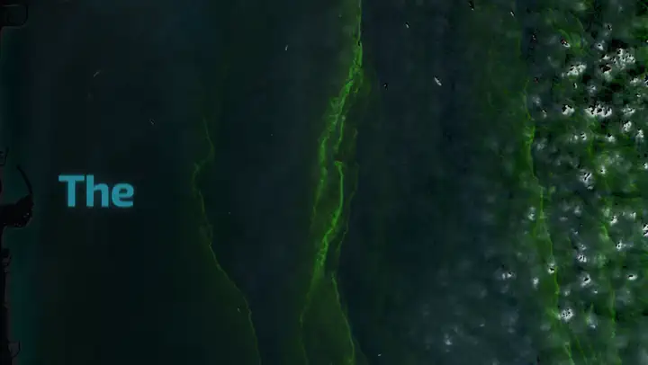
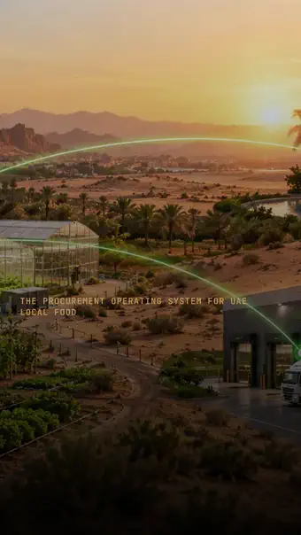
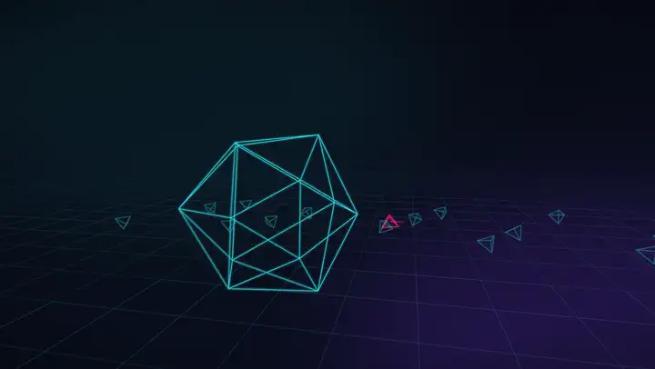
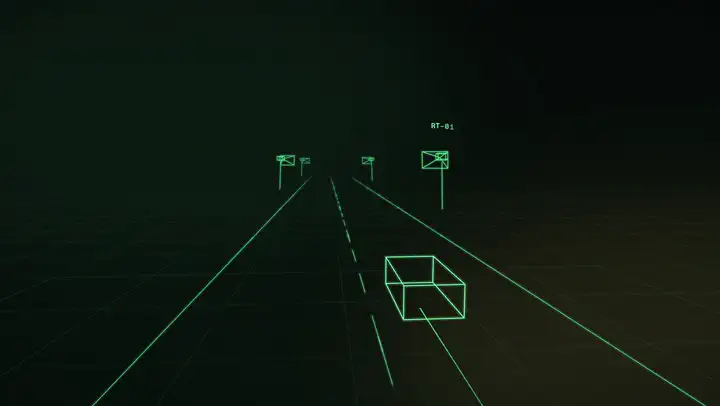

<p align="center">
  <picture>
    <source media="(prefers-color-scheme: dark)" srcset="docs/brand/ks-light.png">
    
  </picture>
</p>

<h1 align="center">Kanban Motion</h1>

<p align="center"><b>Motion graphics as code, locked to a voice.</b><br>Made by <b>Kanban Studios</b>.</p>

Kanban Motion is a Claude Code skill that turns a project, a website or a script into a short, polished video. Every frame is a pure function of time, every word lands on the voiceover, and the preview is identical to the export.

[](https://cdn.jsdelivr.net/gh/4waiz/kanban-motion@v1.3.0/docs/kanban-motion-demo.mp4)

*The demo above was made entirely with this skill: the script, the Kokoro voice, the word alignment, the plates, the generated music bed, the CC0 effects, the -14 LUFS mix and the poster frame. Click it to play with sound.*

## Examples

Five videos made with Kanban Motion from Kanban Studios projects, each from the prompt shown above it. Every one has a voiceover, five different Kokoro voices all generated locally. The previews loop silently; click one to play the full video with sound. Every reel's source is in [`examples/`](examples).

### BLUEBAN 813 · 30 s · 16:9 · voice: bm_george

```text
/kanban-motion Make a 30-second 16:9 launch video for BLUEBAN 813 from its repo. Open on the real
Sentinel-2 frame of the Fujairah event with "The UAE drinks the sea." in big type, then sweep a scan
line so the sea "turns" into the NDCI anomaly map. Reveal the logo, count up the archive (5,080
datatakes, 10 areas), light WATCH → DETECT → DIAGNOSE → VERIFY → ACT → LEARN on the voice, and push
the camera into the live dashboard onto the bloom-like patch and the incident card. Calm British
male voice, the app's deep blues and Exo 2, logo end card.
```

[](https://cdn.jsdelivr.net/gh/4waiz/kanban-motion@v1.3.0/docs/examples/blueban-813.mp4)

### SooqRoot · 30 s · 9:16 · voice: am_michael, cut on the beat

```text
/kanban-motion Create a 30-second vertical 9:16 launch video for SooqRoot. Cut on the bars of a
120 bpm track, with a male voiceover whose lines land on those downbeats. Type the hero line letter
by letter as it's spoken, over the farm-network art: "One Order. Many Farms. Confirmed Before Harvest."
Then show the real app running locally: the Demand Translator turning "ten tonnes" into 10,000 kg,
the Commitment Engine splitting the order across five farms (max 23% each), and the farmer's WhatsApp
in Arabic with a one-word reply. Count up the engine's rules and end on a logo reveal with the
hackathon badge. SooqRoot greens on charcoal, Plus Jakarta Sans.
```

<a href="https://cdn.jsdelivr.net/gh/4waiz/kanban-motion@v1.3.0/docs/examples/sooqroot.mp4"></a>

### Encirra · 30 s · 1:1 · voice: af_nova

```text
/kanban-motion Make a 30-second square 1:1 explainer for Encirra, my CBRN command-centre concept.
Open with stats counting up (200 sensors, 4 video feeds, 1 wind field), reveal the logo, then walk
the camera through the real UI as the voice tells the opening scenario: a gamma trend in Unit 3,
sources correlated, the ground robot sent, the drone re-tasked, a person validates. Say clearly it's
a concept on synthetic data. Female voice, Encirra's cyan-on-graphite palette, IBM Plex Sans Condensed.
```

<a href="https://cdn.jsdelivr.net/gh/4waiz/kanban-motion@v1.3.0/docs/examples/encirra.mp4"></a>

### CACK · 15 s · 16:9 · cinematic 3D · voice: am_onyx

```text
/kanban-motion "Create a 15-second cinematic motion graphics sequence with kinetic typography, smooth
shape transitions, 3D elements and seamless camera movement." For CACK: its hexagon mark morphing into
an icosahedron, a crowd of shapes with one moving out of place under the pink target box, a glitching
solid, calibration rings, and CACK's own phrases set in 3D. A deep male voice speaks each phrase as
it lands. Neon cyan and violet from its site.
```

[](https://cdn.jsdelivr.net/gh/4waiz/kanban-motion@v1.3.0/docs/examples/cack.mp4)

### ROADTRACE · 15 s · 16:9 · cinematic 3D · voice: af_bella

```text
/kanban-motion "Create a 15-second cinematic motion graphics sequence with kinetic typography, smooth
shape transitions, 3D elements and seamless camera movement." For ROADTRACE: one chase shot behind a
wireframe car on green lanes, past camera sites RT-01 to RT-04 that fire as it passes, the car morphing
into its visual fingerprint, then rising into the simulation's own golden-hour render. A female
voice on each beat.
```

[](https://cdn.jsdelivr.net/gh/4waiz/kanban-motion@v1.3.0/docs/examples/roadtrace.mp4)

Re-render any example after `npm install --prefix skills/kanban-motion/scripts`:

```bash
node skills/kanban-motion/scripts/render.mjs video --dir examples/blueban-813 --samples 6 --out out/blueban-813.mp4
```

Use `uv run skills/kanban-motion/scripts/mix.py examples/blueban-813/cues.json -o out/mix.wav` for the sound, then add `--audio out/mix.wav` to the render.

## What it does

- **Plates as code.** Each scene is a small JS module that draws a frame from `f.t`. Headless Chrome captures frames and ffmpeg encodes them, with optional motion blur (sub-frame sampling), 4K, and vertical or square formats.
- **Launch-video and cinematic plates.** Real UI with camera moves and callouts that track it, count-up stats, typed headlines, pipelines that light up on the voice, logo reveals, and a 3D `space` plate: morphing wireframe solids, kinetic type in 3D and one seamless camera move.
- **Voiceover, start to finish.** Write a script, generate the voice locally with Kokoro (open weights, no API key), or bring your own recording. Word-level timings come from faster-whisper, snapped onto the script's exact words. Plates find words by content (`cut('Every word')`), so when the voice changes, the video re-times itself.
- **Launch-video brain.** It inspects the project or website, writes a plan (angle, hook, highlights, storyboard), and follows creative laws and seven tones (default, polished, yc-parody, chaotic, deadpan, cinematic, app-store).
- **Sound.** An original, royalty-free music bed generator (key, tempo, style, beat grid), a curated CC0 effects library with a brightness and risk analysis, and a mixer that ducks music and effects under the voice and masters to -14 LUFS.
- **Delivery.** It bakes the best settled frame in as frame 0, so every platform's thumbnail looks right, and writes share copy.
- **Works with the Motion as Code kit.** If you have that kit, the skill keeps its full workflow (plates, timeline, stills, render, SFX mix, voiceover swap) and adds everything above.

## Install

**Claude Code plugin**

```
/plugin marketplace add 4waiz/kanban-motion
/plugin install kanban-motion@kanban-motion
```

**Or copy the skill**

```bash
git clone https://github.com/4waiz/kanban-motion.git
cp -r kanban-motion/skills/kanban-motion ~/.claude/skills/kanban-motion
```

**Or upload it to claude.ai.** Download `kanban-motion.skill.zip` from [Releases](https://github.com/4waiz/kanban-motion/releases) and add it under Settings > Capabilities > Skills.

**One-time setup** (renderer dependency):

```bash
npm install --prefix ~/.claude/skills/kanban-motion/scripts
```

Requirements:
- Node 18+
- Google Chrome or Microsoft Edge
- ffmpeg with libx264
- [uv](https://docs.astral.sh/uv/), which installs the Python audio tools on first use

## Use it

Talk to Claude Code:

- "Make a launch video for this project, with a voiceover."
- "Turn https://example.com into a 20 second promo, chaotic tone, vertical."
- "Make a vertical Instagram ad for this repo."
- "Add a British male voiceover and re-time the plates."
- "Swap the voiceover for my recording in audio/me.wav."
- "Render the video." (it always asks before a full render)

## Pipeline

```
script.txt ─▶ voiceover.py (Kokoro) ─▶ voiceover.wav + lines.json
                                   └─▶ align.py (faster-whisper + script snap) ─▶ words.json + audio.json
bed.py ─▶ music.wav + beats.json     (or beats.py on your own track)
reel/ plates + timeline ─▶ render.mjs stills (check) ─▶ cues.json ─▶ mix.py ─▶ mix.wav
                                                        render.mjs video --audio mix.wav ─▶ reel.mp4 ─▶ poster as frame 0
```

| Script | What it does |
| --- | --- |
| `scripts/render.mjs` | `preview`, `stills` (incl. `--plates`), `video` (motion blur, 4K, part ranges, audio mux) |
| `scripts/voiceover.py` | Script to voice with Kokoro (voice blends, speed, pauses) or the OS voice |
| `scripts/align.py` | Word timings for any voiceover, snapped to the script; loudness envelope |
| `scripts/bed.py` | Original music bed: `pad`, `pulse`, `beat`; any key; beat grid |
| `scripts/beats.py` | Beat grid and strong onsets for a track you supply |
| `scripts/mix.py` | Cue sheet to ducked, mastered mix (-14 LUFS, -1 dBTP), with word-anchored cue times |

## Credits

- Made by **Kanban Studios**.
- Extends the **Motion as Code** workflow (its kit's engine and visual style are pdoom-video by mexicat, MIT) and draws on ideas from the **/brag** launch-video skill.
- Voice: [Kokoro-82M](https://huggingface.co/hexgrad/Kokoro-82M) (Apache-2.0) via [kokoro-onnx](https://github.com/thewh1teagle/kokoro-onnx).
- Alignment: [faster-whisper](https://github.com/SYSTRAN/faster-whisper) (MIT).
- Sound effects: [Kenney](https://kenney.nl) (CC0) and the [Keyboard Soundpack #1](https://opengameart.org/content/keyboard-soundpack-1-typing-and-single-keystrokes) by unicae_games (CC0).

## License

[MIT](LICENSE) © Kanban Studios for the code and docs. The bundled sound effects are CC0. The Kanban Studios name and KS logo are the studio's marks and are not covered by the MIT license. Neither are the example projects' names, logos, screenshots and renders in `examples/` and `docs/examples/`, which belong to their projects (BLUEBAN 813, SooqRoot, Encirra, CACK and ROADTRACE).
