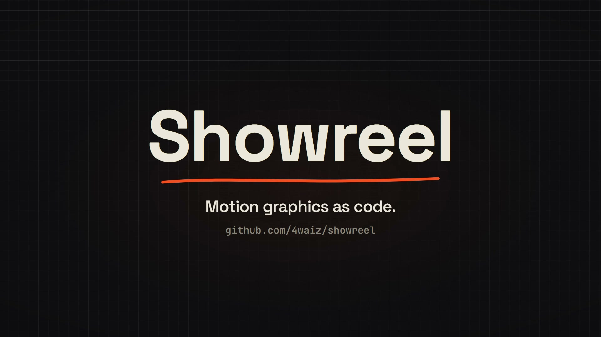

# Showreel

**Motion graphics as code, locked to a voice.** A Claude Code skill that turns a project, a website or a script into a short, polished video. Every frame is a pure function of time, every word lands on the voiceover, and the preview is identical to the export.

[](docs/showreel-demo.mp4)

*The demo above was made entirely with this skill: the script, the Kokoro voice, the word alignment, the plates, the generated music bed, the CC0 effects, the -14 LUFS mix and the poster frame. Click it to play.*

## What it does

- **Plates as code.** Each scene is a small JS module that draws a frame from `f.t`. Headless Chrome captures frames and ffmpeg encodes them, with optional motion blur (sub-frame sampling), 4K, and vertical or square formats.
- **Voiceover, start to finish.** Write a script, generate the voice locally with Kokoro (open weights, no API key), or bring your own recording. Word-level timings come from faster-whisper, snapped onto the script's exact words. Plates find words by content (`cut('Every word')`), so when the voice changes, the video re-times itself.
- **Launch-video brain.** It inspects the project or website, writes a plan (angle, hook, highlights, storyboard), and follows creative laws and seven tones (default, polished, yc-parody, chaotic, deadpan, cinematic, app-store).
- **Sound.** An original, royalty-free music bed generator (key, tempo, style, beat grid), a curated CC0 effects library with a brightness and risk analysis, and a mixer that ducks music and effects under the voice and masters to -14 LUFS.
- **Delivery.** It bakes the best settled frame in as frame 0, so every platform's thumbnail looks right, and writes share copy.
- **Works with the Motion as Code kit.** If you have that kit, the skill keeps its full workflow (plates, timeline, stills, render, SFX mix, voiceover swap) and adds everything above.

## Install

**Claude Code plugin**

```
/plugin marketplace add 4waiz/showreel
/plugin install showreel@showreel
```

**Or copy the skill**

```bash
git clone https://github.com/4waiz/showreel
cp -r showreel/skills/showreel ~/.claude/skills/showreel
```

**Or upload it to claude.ai.** Download `showreel.skill.zip` from [Releases](https://github.com/4waiz/showreel/releases) and add it under Settings > Capabilities > Skills.

**One-time setup** (renderer dependency):

```bash
npm install --prefix ~/.claude/skills/showreel/scripts
```

Requirements:
- Node 18+
- Google Chrome or Microsoft Edge
- ffmpeg with libx264
- [uv](https://docs.astral.sh/uv/), which installs the Python audio tools on first use

## Use it

Talk to Claude Code:

- "Make a launch video for this project, with a voiceover."
- "Turn https://example.com into a 20 second promo, chaotic tone, vertical."
- "Add a British male voiceover and re-time the plates."
- "Swap the voiceover for my recording in audio/me.wav."
- "Render the video." (it always asks before a full render)

## Pipeline

```
script.txt ─▶ voiceover.py (Kokoro) ─▶ voiceover.wav + lines.json
                                   └─▶ align.py (faster-whisper + script snap) ─▶ words.json + audio.json
bed.py ─▶ music.wav + beats.json     (or beats.py on your own track)
reel/ plates + timeline ─▶ render.mjs stills (check) ─▶ cues.json ─▶ mix.py ─▶ mix.wav
                                                        render.mjs video --audio mix.wav ─▶ reel.mp4 ─▶ poster as frame 0
```

| Script | What it does |
| --- | --- |
| `scripts/render.mjs` | `preview`, `stills` (incl. `--plates`), `video` (motion blur, 4K, part ranges, audio mux) |
| `scripts/voiceover.py` | Script to voice with Kokoro (voice blends, speed, pauses) or the OS voice |
| `scripts/align.py` | Word timings for any voiceover, snapped to the script; loudness envelope |
| `scripts/bed.py` | Original music bed: `pad`, `pulse`, `beat`; any key; beat grid |
| `scripts/beats.py` | Beat grid and strong onsets for a track you supply |
| `scripts/mix.py` | Cue sheet to ducked, mastered mix (-14 LUFS, -1 dBTP), with word-anchored cue times |

## Credits

- Extends the **Motion as Code** workflow (its kit's engine and visual style are pdoom-video by mexicat, MIT) and draws on ideas from the **/brag** launch-video skill.
- Voice: [Kokoro-82M](https://huggingface.co/hexgrad/Kokoro-82M) (Apache-2.0) via [kokoro-onnx](https://github.com/thewh1teagle/kokoro-onnx).
- Alignment: [faster-whisper](https://github.com/SYSTRAN/faster-whisper) (MIT).
- Sound effects: [Kenney](https://kenney.nl) (CC0) and the [Keyboard Soundpack #1](https://opengameart.org/content/keyboard-soundpack-1-typing-and-single-keystrokes) by unicae_games (CC0).

## License

[MIT](LICENSE) for the code and docs. The bundled sound effects are CC0.
